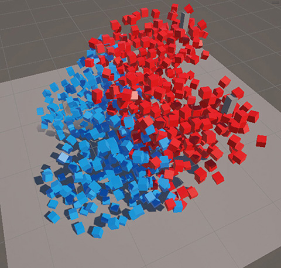
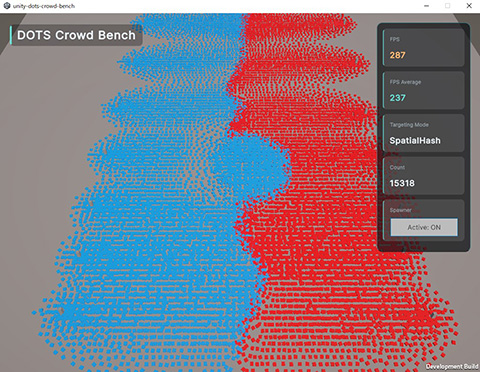
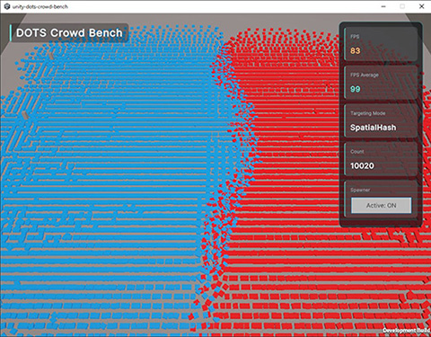

# unity-dots-crowd-bench

Unity DOTS/ECS で大量エンティティ処理を検証するプロジェクトです。
Boid 理論による移動制御、索敵アルゴリズム（総当たり / 空間ハッシュ）の性能比較、
さらに ECS（データ指向）と MVP（VContainer / R3）で Entity の状態をモニタリングする設計を扱っています。

## デモ

### スクリーンショット

## 概要
- 2陣営のユニットが出現し、Boid 理論（分離・整列・結合）で群れを形成しながら相手陣営と交戦します。
- FPS と処理時間をリアルタイムで計測・表示します。

## 技術スタック
- Unity 6.3 LTS / URP
- Unity Entities（DOTS/ECS）
- VContainer + R3（MVP, UI 層）
- URP / Entities Graphics

## アーキテクチャ
### System構成
Spawner → Targeting（BruteForce / SpatialHash）→ Boid → Damage → Despawner

| System名 | 役割 |
|---|---|
| Spawner | Entity のスポーンを行う |
| Targeting | 自陣営以外の Entity を総当たりで索敵する |
| SpatialHashTargeting | 自陣営以外の Entity を空間ハッシュで索敵する |
| Boid | Boid 理論で群れの動きを制御する |
| Damage | 索敵で発見した Entity にダメージを与える |
| Despawner | HP が 0 以下の Entity を削除する |

### ECSとMVPの境界設計
ECS から情報を取得する Model、情報を表示する UIView（UI Toolkit）、それらをつなぐ Presenter で MVP を構成しています。
Model は Entity の情報収集に専念し、UIView は受け取った情報の表示のみを担当します。
依存関係は VContainer で注入しています。

## パフォーマンス検証（2026/08/06）

### 検証環境
- 15,000 体の Entity
- ユニットサイズ: 1f × 1f
- cellSize = 2f
- 空間ハッシュ索敵の CellSpan = 1（自身のセルと周囲 26 セル、計 27 セル）

### 検証結果
| System | Main Thread | Worker Thread (1〜3) |
|---|---:|---:|
| SpatialHashTargetingSystem | - | 1.07 ms |
| BoidSystem | - | 2.46 ms |
| SpatialHashBuildSystem | - | 0.57 ms |
| JobHandle.Complete | 3.47 ms | - |

※ Development Build で計測しました。FPS はおおむね 200〜250 前後でした。
※ JobHandle.Complete は、EndFixedStepSimulationEntityCommandBufferSystem における待機時間（メインスレッド側）です。

SpatialHashTargetingSystem と BoidSystem の計算処理を最適化し、Entity ID でフレーム分散したことにより、15,000 体の Entity を出現させても十分なパフォーマンスを確保できています。
また、SpatialHash を Team+Cell の合成キー化したことで、Boid/Targeting の検索対象範囲を絞り込み、負荷軽減に大きく寄与しました。

### 最適化の過程
- Despawner を含む主要 System をすべて Job 化
- System 全体の更新基準を、メインスレッドの FPS 依存から固定ステップ（FixedStep）に変更 [#40]
- SpatialHashTargetingSystem と BoidSystem の 1 フレーム内計算量を低減 [#51]
- SpatialHash を Team+Cell の合成キー化し、Boid/Targeting の負荷を大幅削減 [#52]

## 今後の展望
- 3つ以上の複数チーム対応 [[#53](https://github.com/hirojun5670/unity-dots-crowd-bench/issues/53)]

## パフォーマンス検証（2026/07/27）

### 検証環境
- 10,000 体の Entity
- ユニットサイズ: 1f × 1f
- cellSize = 2f
- 空間ハッシュ索敵の CellSpan = 1（自身のセルと周囲 26 セル、計 27 セル）
- SpatialHashTargetingSystem と BoidSystem を Job 化し、空間ハッシュの計算部分を共通化しました。[#33](https://github.com/hirojun5670/unity-dots-crowd-bench/pull/33)

### 検証結果
| System | Main Thread | Worker Thread (1〜3) |
|---|---:|---:|
| SpatialHashTargetingSystem | 0.01 ms 以下 | 2.89 ms |
| BoidSystem | 0.01 ms 以下 | 2.83 ms |
| SpatialHashBuildSystem | 0.04 ms | 0.42 ms |
| DamageSystem | 6.33 ms | - |

※ Development Build で計測しました。FPS はおおむね 100 前後でした。
計算量の多かったシステムを Worker Thread で並列処理したことで、10,000 体の Entity でも Main Thread には十分な余裕がありました。
一方で、処理数が増えたことで、Job 化されていない DamageSystem が新たなボトルネックになりました。

### 最適化の過程
- 空間ハッシュ計算を別 System に切り出し、Job 化しました。
- 空間ハッシュ計算時に位置情報のスナップショットを記録し、SpatialHashTargetingSystem と BoidSystem で再利用する構成に変更しました。
- メインスレッドで実行していた SpatialHashTargetingSystem と BoidSystem の処理を Job 化して並列化しました。

## 今後の展望
- DamageSystemのJob化対応 [#34](https://github.com/hirojun5670/unity-dots-crowd-bench/issues/34)

## パフォーマンス検証（2026/07/23）
### 検証環境
- 1000体の Entity
- ユニットサイズ: 1f x 1f
- cellSize = 2f
- 空間ハッシュ索敵の CellSpan = 1（自身のセル + 周囲 26 セルの計 27 セル）
- Job による並列化なし

### 検証結果
| System | Update にかかった時間 | FPS |
|---|---|---|
| 総当たり | 3.2ms | 140fps |
| 空間ハッシュ | 0.84ms | 190fps |
| Boid | 1.16ms | - |

※ Development Build で計測。

空間ハッシュ導入による高速化が確認できました。
Boid は索敵処理に直接関与しないため、別軸の一定負荷として存在します。

### 最適化の過程
1. sqrt の回数を抑えるよう計算式を見直し。
2. ComponentLookup の重複参照を削減し、不要なアクセスを抑制。
3. 空間ハッシュ索敵時に CellSpan が 2 以上になると探索セル数が急増するため、今回の検証では CellSpan = 1 を維持するよう調整。
4. Entity が密集しすぎると計算負荷が高まるため、分離（Separation）の Weight を高めに調整。
5. さらなる改善には Job による並列化が必要。

## 今後の展望
- JobEntity による並列化 [#21](https://github.com/hirojun5670/unity-dots-crowd-bench/issues/21)
- 陣営ごとのユニット総数を UI に表示 [#25](https://github.com/hirojun5670/unity-dots-crowd-bench/issues/25)

## ライセンス
The source code in this repository is licensed under the [MIT License](./LICENSE).